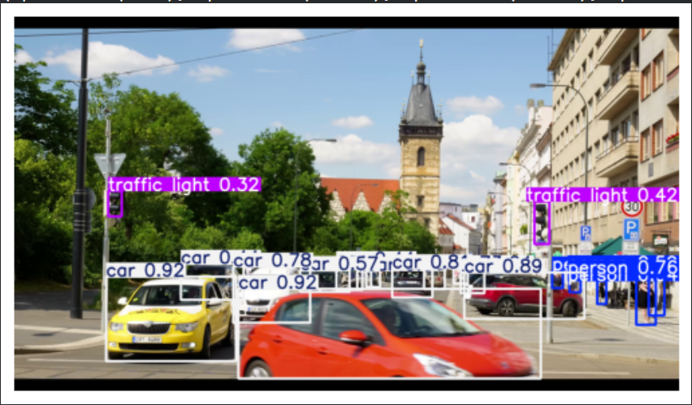

# Traffic Object Detection using YOLO

##  Overview
This project uses the YOLO model to detect objects such as cars and pedestrians in traffic videos.

## Technologies
- Python
- YOLO
- OpenCV
- Computer Vision
- Artificial Intelligence
- Machine Learning
- Deep Learning

##  Features
- Detects cars
- Detects pedestrians
- Works on video streams

## 🏆 Achievement
AI Solution of the Year – iSchool Talents 2025

## Demo

